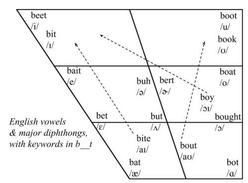

```{r setup, include=FALSE}
options(htmltools.dir.version = FALSE)
```


class: inverse, center, middle

# Get Started

---

class: center, top

background-image: url(http://4.bp.blogspot.com/-bmMQs9OMHwA/T5YwmvEt62I/AAAAAAAAAEQ/jFKepTJDV9g/s400/1000px-Cardinal_vowel_tongue_position-front-wide_svg.jpg)

background-size: 60%
background-position: 50% 80%

# Lip and Tongue placement

???

Image credit: [English in Vancouver](http://englishinvancouver.blogspot.com/2012/04/vowel-sounds_22.html)

---
class: center, middle

# Can you hear the difference?

--

### bait bet bat


---

class: center, top

background-image:url(https://66.media.tumblr.com/65ffd05051be26e61e171729061b28bc/tumblr_inline_p7k1gnqJPG1rplshr_500.png)
background-size: 70%
background-position: 50% 90%

# Every vowel matters
*Always refer back to this lip/tongue placement*

???
Image credit: [All things linguistics](https://allthingslinguistic.com/post/67308552090/how-to-remember-the-ipa-vowel-chart)

---

class: inverse, center, middle

# Time For Assesement !

---
.left-column[

## sit seat

]

.right-column[

]

---

.left-column[

## sit seat
## desk disk

]

.right-column[

]
---

.left-column[

## sit seat
## desk disk
## wet wait

]

.right-column[

]
---
.left-column[

## sit seat
## desk disk
## wet wait
## bat but

]

.right-column[

]

---

.left-column[

## sit seat
## desk disk
## wet wait
## bat but
## so saw
]

.right-column[

]

---

.left-column[

## sit seat
## desk disk
## wet wait
## bat but
## so saw
## bed bad
]

.right-column[

]

---

.left-column[

## sit seat
## desk disk
## wet wait
## bat but
## so saw
## bed bad
## boat bought
]

.right-column[

]

---

.left-column[

## Luke look


]

.right-column[


]

---

.left-column[

## Luke look
## run round


]

.right-column[


]

---

.left-column[

## Luke look
## run round
## heart hut


]

.right-column[


]
---

.left-column[

## Luke look
## run round
## heart hut
## shut shot


]

.right-column[


]

---

.left-column[

## Luke look
## run round
## heart hut
## shut shot
## lauch lunch


]

.right-column[


]

---

.left-column[

## Luke look
## run round
## heart hut
## shut shot
## lauch lunch
## spoon


]

.right-column[


]

---

class: inverse, center, middle

# It's getting harder...


---

## The Rainbow Passage

When the sunlight strikes raindrops in the air, they act as a prism and form a rainbow. The rainbow is a division of white light into many beautiful colors. These take the shape of a long round arch, with its path high above, and its two ends apparently beyond the horizon.

There is, according to legend, a boiling pot of gold at one end. People look, but no one ever finds it. When a man looks for something beyond his reach, his friends say he is looking for the pot of gold at the end of the rainbow.

Throughout the centuries people have explained the rainbow in various ways. Some have accepted it as a miracle without physical explanation. To the Hebrews it was a token that there would be no more universal floods. The Greeks used to imagine that it was a sign from the gods to foretell war or heavy rain. The Norsemen considered the rainbow as a bridge over which the gods passed from earth to their home in the sky.

???

source: [here](https://www.york.ac.uk/media/languageandlinguistics/documents/currentstudents/linguisticsresources/Standardised-reading.pdf)
---

## The Rainbow Passage (con't)


Others have tried to explain the phenomenon physically. Aristotle thought that the rainbow was caused by reflection of the sun's rays by the rain. Since then physicists have found that it is not reflection, but refraction by the raindrops which causes the rainbows.

Many complicated ideas about the rainbow have been formed. The difference in the rainbow depends considerably upon the size of the drops; the width of the colored band increases as the size of the drops increases. The actual primary rainbow observed is said to be the effect of a super-imposition of a number of bows. If the red of the second bow falls upon the green of the first, the result is to give a bow with an abnormally wide yellow band, since red and green light when mixed form yellow. This is a very common type of bow, one showing mainly red and yellow, with little or no green or blue.

---

class: inverse, center, middle

# Are you ready for some speaking time ?

--

## describe what you see in the next slide for **2 minutes**
---

background-image:url(https://image.cnbcfm.com/api/v1/image/105464942-1537556383277gettyimages-102183935.jpeg?v=1566579981&w=1400&h=950)
background-size: 100%
background-position: contain

---

class: inverse, center, middle

# Let's try again with the same picture

---

background-image:url(https://image.cnbcfm.com/api/v1/image/105464942-1537556383277gettyimages-102183935.jpeg?v=1566579981&w=1400&h=950)
background-size: 100%
background-position: contain

---

class: inverse, top, middle

# Summary

--
# minimal pair

--
# rainbow passage

--
# speaking

--
# conversation

---

class: center, middle

# Thank you :)